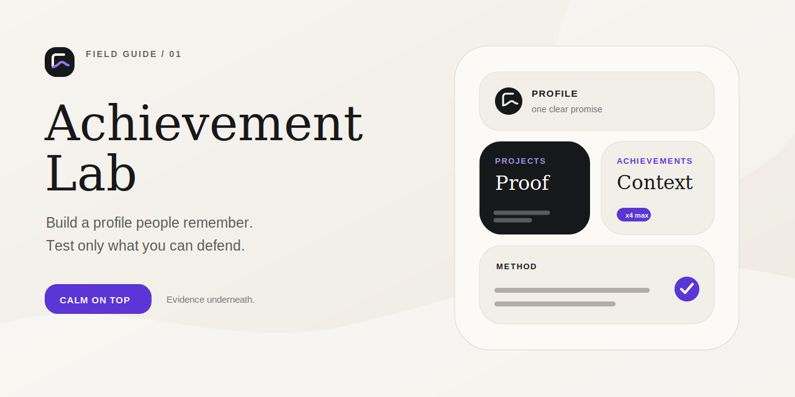

<p align="center">
  
</p>

<p align="center">
  <strong>Make your GitHub profile legible, credible, and unmistakably yours.</strong><br>
  A responsible field guide, a guarded experiment runner, and reusable profile patterns.
</p>

<p align="center">
  <a href="docs/ACHIEVEMENTS.md">Achievement atlas</a> ·
  <a href="docs/PROFILE-README.md">Profile README</a> ·
  <a href="docs/BADGES-AND-TOPICS.md">Badges & topics</a> ·
  <a href="docs/RESPONSIBLE-TESTING.md">Responsible testing</a>
</p>

<p align="center">
  <a href="https://github.com/angusu-de/achievement-lab/actions/workflows/test.yml"></a>
  <a href="https://www.python.org/"></a>
  <a href="LICENSE"></a>
  <a href="SECURITY.md"></a>
</p>

## Start here

Achievement Lab separates two jobs that are often mixed together:

| Build a profile people remember | Test what GitHub actually awards |
|---|---|
| Tell a clear story with a profile README, six deliberate pins, useful repository topics, restrained badges, and strong project pages. | Use two accounts you control, one dedicated evidence repository, tiny batches, explicit confirmation, and no fake social signals. |

The first path matters more. An achievement is a small proof point; it is not a substitute for work worth opening.

### The complete field guide

- **[Achievement atlas](docs/ACHIEVEMENTS.md)** — active, tiered, social, historical, and uncertain achievements; what `x4` means; what cannot responsibly be automated.
- **[Profile README playbook](docs/PROFILE-README.md)** — create the special username repository, structure the page, support light/dark artwork, and start from a copyable template.
- **[Badges, topics & proof](docs/BADGES-AND-TOPICS.md)** — use labels that communicate instead of decorate; includes ready-to-use snippets.
- **[Responsible testing](docs/RESPONSIBLE-TESTING.md)** — the safety boundary, rate discipline, privacy model, and a preflight checklist.
- **[Experiment guide](docs/EXPERIMENTS.md)** — what the runner can reproduce and why some paths remain manual.
- **[Contributing](CONTRIBUTING.md)** — how to submit a new observation without turning folklore into documentation.

## Achievement tiers, without folklore

GitHub displays a base achievement and up to four visible tiers: `x1`, `x2`, `x3`, and `x4`. **There is no visible `x8` tier.** Community-observed checkpoints are useful for planning, but GitHub does not publish a stable achievement-threshold API and the feature remains in public preview.

| Achievement | Responsible route | Visible ceiling | Lab automation |
|---|---|---:|---|
| Pull Shark | Author useful PRs that get merged | `x4` observed | guarded |
| Galaxy Brain | Give accepted answers in Discussions | `x4` observed | manual |
| Pair Extraordinaire | Ship genuine co-authored commits | `x4` observed | guarded |
| Starstruck | Build repositories people choose to star | `x4` observed | never |
| Quickdraw | Close an issue shortly after opening it | base | guarded |
| Public Sponsor | Sponsor open-source work publicly | base | never |

See the [atlas](docs/ACHIEVEMENTS.md) for observed checkpoints, confidence labels, retired achievements, and source notes.

## Safe experiment runner

The runner creates transparent evidence in one dedicated repository. It never implements profile README writes, repository deletion, stars, followers, sponsors, reactions, or activity in third-party projects.

### Guided mode — recommended

Run the script without arguments in a terminal. It opens an English, numbered
assistant that explains every choice, defaults to private evidence, previews
writes, and runs one controlled event at a time.

```bash
python3 achievement_lab.py
```

No hidden defaults: the screen always shows the target account, repository,
visibility, event, and exact count before confirmation.

### Explicit commands — for repeatable workflows

```bash
git clone https://github.com/angusu-de/achievement-lab.git
cd achievement-lab
cp examples/achievement-lab.example.json achievement-lab.json

gh auth login --hostname github.com --web
gh auth login --hostname github.com --web  # only for two-account scenarios

python3 achievement_lab.py catalog
python3 achievement_lab.py setup
python3 achievement_lab.py --config achievement-lab.json doctor
python3 achievement_lab.py --config achievement-lab.json --dry-run init
python3 achievement_lab.py --config achievement-lab.json init
python3 achievement_lab.py --config achievement-lab.json add quickdraw --count 1
python3 achievement_lab.py --config achievement-lab.json status
```

`catalog` is read-only and needs no config. Every write command shows its target and asks for confirmation. The configured repository name must contain `achievement-lab`; batches are capped; generated artifacts use the `ALAB` prefix.

## Supported scenarios

| Scenario | What the lab creates | Helper account |
|---|---|---:|
| Quickdraw | one clearly labelled issue, immediately closed | no |
| YOLO event test | one author-created PR, merged without review | no |
| Pull Shark | one authored PR, merged by the helper | yes |
| Pair Extraordinaire | one commit with a valid co-author trailer | yes |

Galaxy Brain stays manual because Discussions categories, permissions, and answer marking vary. Social signals stay human because they represent another person's choice.

## Design system

The visual language is intentionally quiet: warm paper, ink, one violet accent, generous space, and soft squircles. The hero is a small, accessible SVG rather than a heavy animation. Reuse the [profile surface template](templates/profile/assets/profile-surface.svg) or adapt the [profile README starter](templates/profile/README.md) without copying someone else's identity.

## Trust model

- **Official** means a behavior is documented by GitHub.
- **Observed** means it has been reproduced by the community or this lab, but may change.
- **Historical** means the award is visible on older profiles but is no longer earnable in the same way.
- **Unverified** means the name or trigger circulates without enough current evidence.

GitHub decides whether and when an achievement appears. This project documents evidence; it does not promise badges and is not affiliated with GitHub.

## License

MIT — see [LICENSE](LICENSE).
