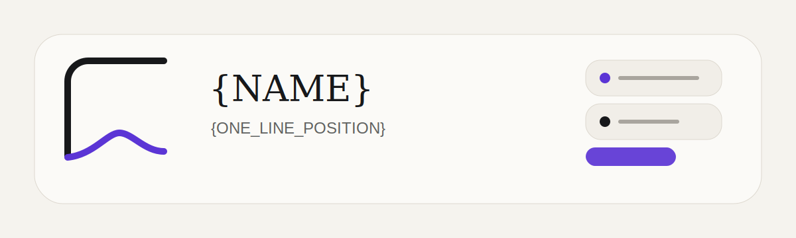

  

# {NAME}

{ONE_SENTENCE_ABOUT_THE_WORK_AND_WHO_IT_HELPS}

## Selected work

| Project | Why it exists |
|---|---|
| **[{PROJECT_ONE}]({PROJECT_ONE_URL})** | {OUTCOME_FIRST_DESCRIPTION} |
| **[{PROJECT_TWO}]({PROJECT_TWO_URL})** | {OUTCOME_FIRST_DESCRIPTION} |
| **[{PROJECT_THREE}]({PROJECT_THREE_URL})** | {OUTCOME_FIRST_DESCRIPTION} |

## How I work

- {PRINCIPLE_ONE}
- {PRINCIPLE_TWO}
- {PRINCIPLE_THREE}

## Now

{ONE_CURRENT_FOCUS_WITH_A_REAL_LINK_IF_PUBLIC}

## Contact

[{WEBSITE_LABEL}]({WEBSITE_URL}) · [{CONTACT_LABEL}]({CONTACT_URL})

<!--
Keep this page fast and current. Put detailed installation, architecture,
screenshots, changelogs, and support notes in the individual project repos.
Replace every placeholder before publishing.
-->
